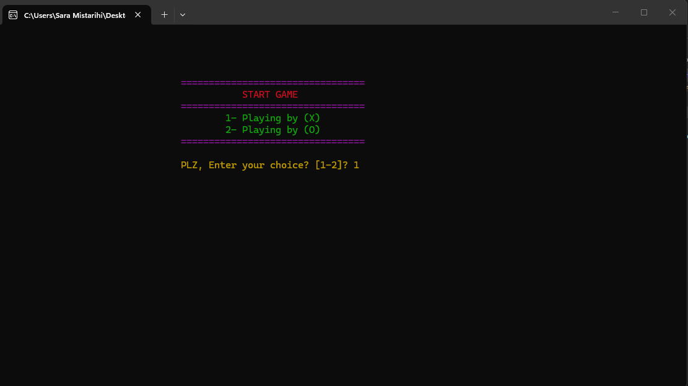
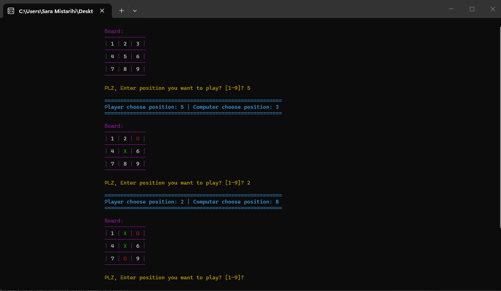
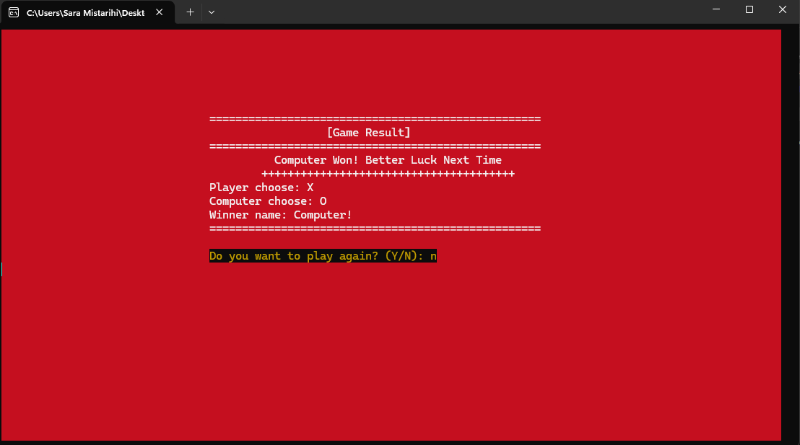

# ❌⭕ Tic Tac Toe Game (C++)

A console-based Tic Tac Toe (XO) game developed in C++, featuring modular design, smart AI decision-making, and enhanced console interaction using colors and sound effects. This project was developed to demonstrate clean C++ programming practices, basic AI logic, and console-based user interaction.

---

## 📌 Features
- Player vs Computer gameplay
- Smart AI:
  - Tries to win
  - Blocks player from winning
  - Random moves when no strategic move is available
- Round-by-round game display
- Color-coded console output for better visualization:
  - Player moves (`X`) in green
  - Computer moves (`O`) in red
  - Draws in yellow
- Sound effects for game results
- Replay option after game ends
- Clean console interface with clear instructions

---

## 🛠️ Technologies & Concepts Used
- C++
- Enums & Structs
- Functions & Modular Programming
- Loops & Conditional Statements
- Random Number Generation
- Console I/O (`cin`, `cout`)
- Windows-specific console color and sound (`Windows.h`, `SetConsoleTextAttribute`, `Beep`)

---

## 🧠 Game Logic Overview
- Player selects their symbol:
  - `1` → X
  - `2` → O
- Computer automatically gets the opposite symbol
- Player chooses a position (1-9) on a 3x3 board
- Computer uses **smart AI** to select its move
- Each turn updates the board and checks for a winner
- Game ends when:
  - Player wins
  - Computer wins
  - Draw occurs
- Winner is displayed with:
  - Color-coded screen
  - Sound effects

---

## 📸 Screenshots
### Start Screen


### Gameplay Example


### Game Result



---

## 📋 Requirements
- Windows OS
- C++ Compiler (Visual Studio / MinGW)

---

## ▶️ How to Run the Project

### 1️⃣ Clone the repository
```bash
git clone https://github.com/S-Mistarihi/TicTacToe_CPP.git

```

### 2️⃣ Compile & Run
- Open the project in Visual Studio or any C++ compiler
- Compile  `main.cpp`
- Run the executable (`TicTacToe.exe` on Windows)
- Follow on-screen instructions to play the game (choose X or O, select positions 1-9)

---

## 🧩 Code Design Notes
- The project follows a modular structure using functions.
- Enums and structs are used to improve code readability and maintainability.
- Game logic is separated from input/output handling.

---

## 👤 Author
**Sara AL-Mistarihi**  
Computer Engineering | Junior Flutter Developer   

---

## 📄 License
This project is open for learning and personal portfolio use.

---
